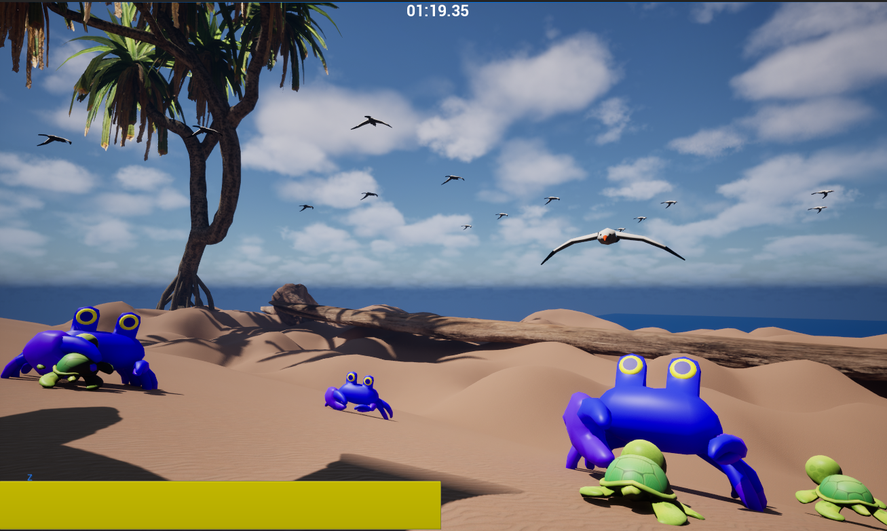

# The Long Crawl

A gameplay prototype built in Unreal Engine 5 using C++ and Blueprints, centered around custom turtle movement, traversal mechanics, and state-based AI.

## Overview

The Long Crawl is an Unreal Engine 5 gameplay prototype where the player controls a turtle navigating an environment with terrain-dependent movement, stamina management, enemy encounters, and autonomous turtle NPCs.

The project focuses on:
- Custom character movement and traversal
- State-based enemy and NPC AI
- Reusable gameplay components and interfaces
- Hybrid C++ and Blueprint gameplay architecture

## Player Movement

The player uses a custom movement system where terrain directly affects traversal.

### Slope Movement
- Slope steepness affects player movement speed
- Steeper uphill movement reduces speed and drains stamina
- Downhill movement increases speed and transitions the player into a sliding state
- Movement behavior is designed to react dynamically to changes in terrain

### Dash & Stamina
- Dash mechanics integrate with the player's movement system
- Stamina is consumed by actions such as climbing and dashing
- Stamina also functions as the player's health pool, with enemy damage reducing the player's maximum available stamina
- Stamina behavior is shared with NPC turtles through reusable gameplay systems

## Enemy AI

Enemies use state-based logic while implementing different detection, movement, and attack behaviors.

### Patrol Crab
The patrol crab idles until the player enters its detection range, then transitions into combat behavior and pursues the player.

### Ambush Crab
The ambush crab remains concealed until the player enters its trigger area, then transitions into its attack behavior and initiates the encounter.

### Bird Enemy
The bird attacks when the player enters its detection area, casting a tracking shadow before swooping down to grab them. A successful grab deals damage and drags the player back to the start unless the player breaks free.

## NPC AI

### Turtle Navigation
Turtle NPCs navigate between waypoints using weighted random selection to vary their paths.

NPC turtles reuse the player's stamina and slope-based movement systems, allowing their traversal to respond to terrain using the same underlying mechanics as the player.

## Architecture

The project uses a hybrid C++ and Blueprint workflow:

- **C++** for core gameplay systems and behavior
- **Blueprints** for gameplay orchestration and iteration
- **Reusable components** for functionality shared between actors
- **Interfaces** to decouple interactions between gameplay systems
- **State-based logic** to organize enemy and NPC behavior

This structure allows different actors to share common functionality while still implementing their own specialized behavior.

## Tech Stack

- Unreal Engine 5
- C++
- Blueprints